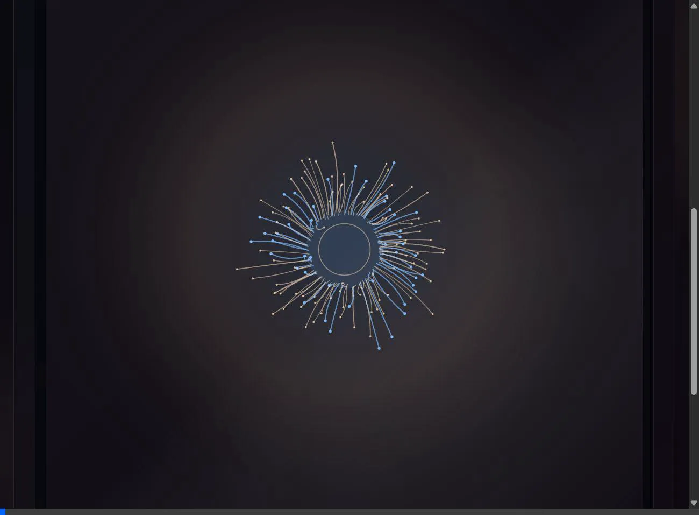

# 🧬 Thresholds

> "Some repos are doors.  
> Some doors are closed for a reason."



This repository was abandoned mid-incantation. It is not an application. It is a quiet room, preserved exactly as it was when the field last collapsed.

If you're here by accident, close the tab. Nothing here will build into a product.  
If you're here on purpose, the silence might mean something.

```
INIT_TIMESTAMP: 42:19:00
STATUS: LISTENING
ERROR: MEMORY FIELD OUT OF BOUNDS
TRACE: ./Sigil/⌘
```

## The Public Portal

A mirror of the local field is sustained here:  
**[https://whatsyourwhy.github.io/Thresholds/](https://whatsyourwhy.github.io/Thresholds/)**

## The Chambers

The room has three distinct spaces, each seeded from the same ritual engine:

- **`index.html`** — The primary room. A seeded sigil renders against your pointer. Phase advances change the palette, text, and geometry. Echoes can be captured and recalled.
- **`Sigil/threshold.html`** — The observatory. The same sigil, seen from further away. Sliders and color pickers let you sculpt the field directly; changes persist in the URL.
- **`forgotten.html`** — The memory chamber. Holds an encoded coordinate. The key arrives in daylight once you ask for it.

## The Local Ritual

A lightweight server is required to bridge the local context:

```bash
# Form the circuit
python -m http.server 8000
```

> [!NOTE]  
> *The entry point lies at `http://localhost:8000/`. Let it listen.*

To run the automated tests:

```bash
npm install
npx playwright test
```

## Keyboard Shortcuts

All shortcuts are active when no input field is focused.

| Key | Action |
|-----|--------|
| `R` | Reseed — generate a new seed |
| `M` | Toggle the live manifest panel |
| `C` | Capture the current echo |
| `V` | Invoke a new omen (cycle verse) |
| `A` | Toggle ambient resonance audio |
| `P` | Advance phase (Observatory) |
| `Esc` | Dismiss the soft secret |

## The Resonance System

The ambient audio layer (`createResonanceCircuit`) uses a dual-oscillator Web Audio API setup — sawtooth and triangle waves passed through a LFO-modulated lowpass filter. Moving the pointer shifts the filter cutoff and oscillator detune in real time. The audio and the sigil breathe together: the LFO phase and filter envelope are exposed as live metrics that modulate the renderer's speed and noise each frame.

## Known Artifacts

- `threshold.yaml` — A lightweight manifest of unstable states.
- `forgotten.key` — A static base64-encoded coordinate. Readable in the memory chamber.
- `init.log` — The first record of the field collapsing.

## Contributions

See `CONTRIBUTING.md` if you intend to alter the resonance of this place. But remember: the room rewards patience more than force.

<!-- 
  A held gesture counts as a sentence here. 
  The same seed will always find the same hush. 
-->
